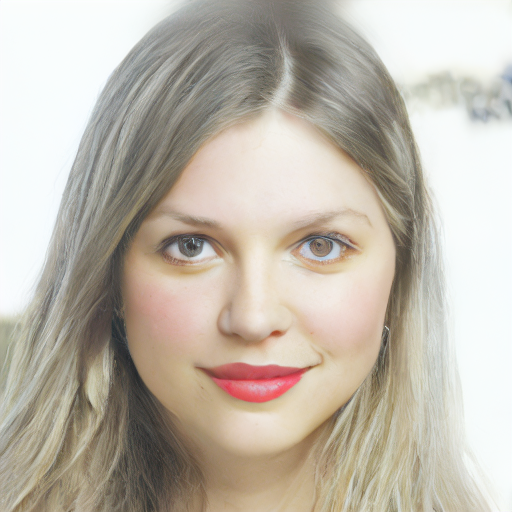
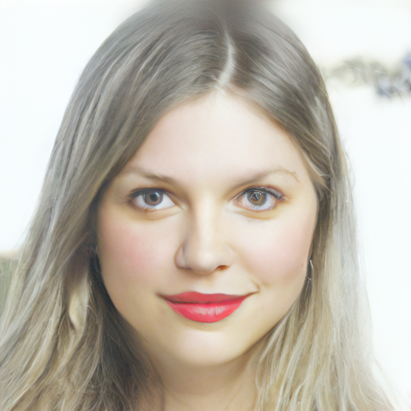
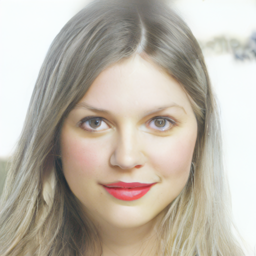
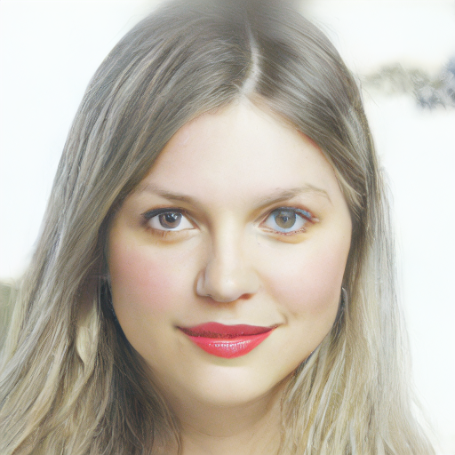
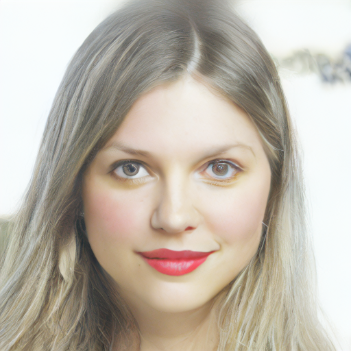
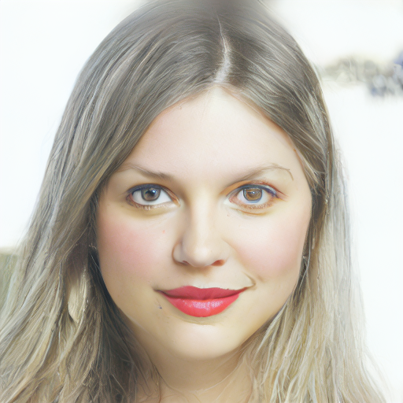
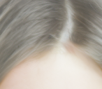

# minKDS: Minimal Kernel Density Steering for Latent Diffusion Models

## Overview

This project implements a novel approach for img2img task - [Kernel Density Steering (KDS)](https://arxiv.org/abs/2507.05604).

## Methodology

- **Base Model**: LDM Super-Resolution 4x (OpenImages)
- **Steering Mechanism**: Kernel density estimation with Gaussian kernel function
- **Parameters**:
  - `band_width`: Controls the kernel bandwidth for density estimation
  - `patch_size`: Size of patches for patch-wise mean-shift
  - `gamma_0`: Base steering strength

## Results Comparison

The following cross table shows the results of different parameter combinations tested on a 128×128 input image upscaled to 512×512:

| Patch Size \ Band Width | 0.1 | 0.3 | 0.6 | 1.0 |
|------------------------|-----|-----|-----|-----|
| **1** |  |  |  |  |
| **2** |  |  |  |  |
| **4** |  |  |  |  |
| **8** |  |  |  |  |

### Baseline Comparison

| Vanilla LDM | Best KDE Result h=1.0, ps=2 |
|--------|--------|
|  |  |

### Detail Comparison (Zoomed)
| Vanilla LDM | Best KDE |
|----------------------|------------------------|
|  |  |

### Parameter Analysis

## Usage

### Basic Usage

```python
import torch 
from PIL import Image
from ldm_pipeline import LDMSuperResolutionPipeline

# Load model
device = "cuda" if torch.cuda.is_available() else "cpu"
pipeline = LDMSuperResolutionPipeline.from_pretrained("path/to/model")
pipeline = pipeline.to(device)

# Load and resize input image
low_res_image = Image.open("input.png")
low_res_image = low_res_image.resize((128, 128))

# Run with KDE steering
result = pipeline(
    low_res_image, 
    num_inference_steps=50, 
    use_KDE=True,
    band_width=1.0,
    patch_size=4,
    gamma_0=0.3
).images[0]

result.save("output.png")
```

### Parameters

- `band_width`: Kernel bandwidth for density estimation (0.1-1.0)
- `patch_size`: Patch size for mean-shift clustering (1, 2, 4, 8)
- `gamma_0`: Base steering strength (default: 0.1)
- `num_particles`: Number of particles for sampling (default: 4)
- `use_KDE`: Enable/disable KDE steering (default: True)

## File Structure

```
├── ldm_pipeline.py      # Main pipeline implementation
├── kds.py              # Kernel Density Steering functions
├── ddim_scheduler.py   # Modified DDIM scheduler with KDE
├── main.py             # Example usage script
├── content/            # Generated results
│   ├── sr.png          # Input image
│   ├── ldm_vanilla.png # Baseline result
│   └── ldm_kde_*.png   # KDE results with different parameters
└── README.md           # This file
```

## Dependencies

- torch
- diffusers
- PIL (Pillow)
- numpy
- einops
- jaxtyping

## TODO
- [ ] Add Dpm++ solver


